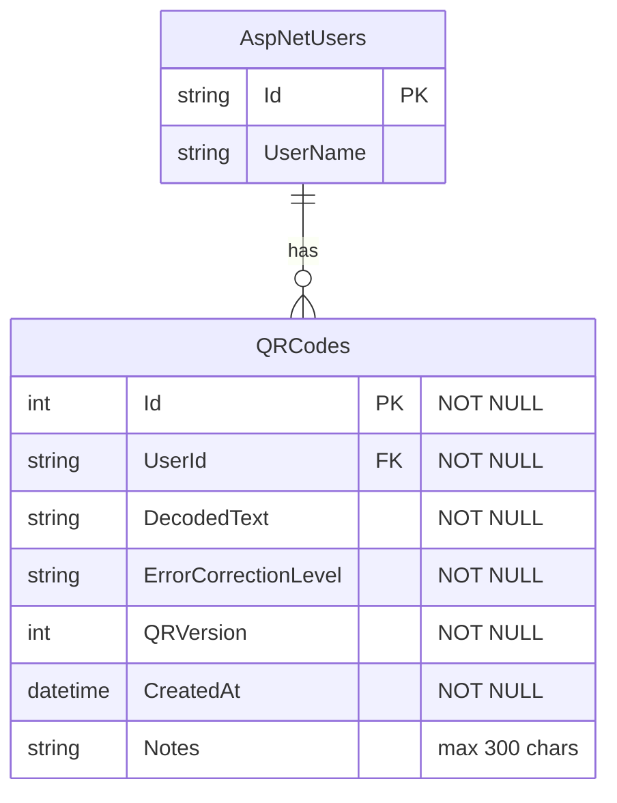
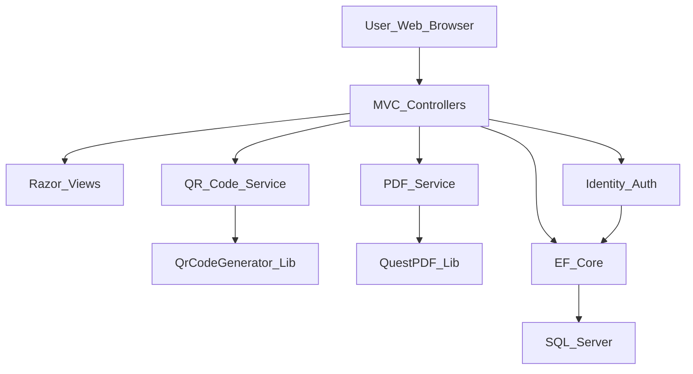
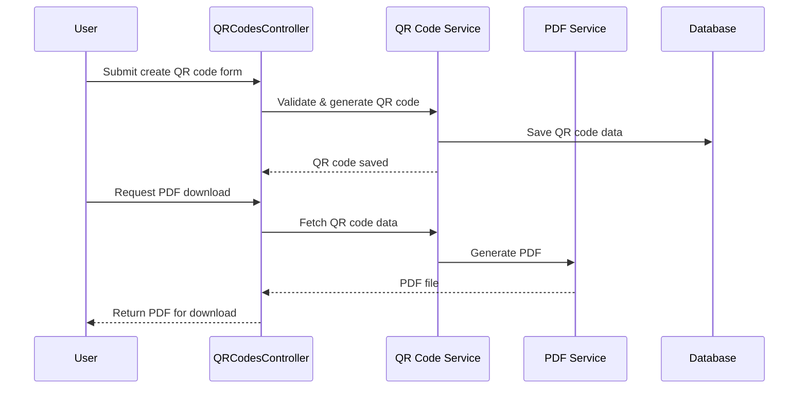
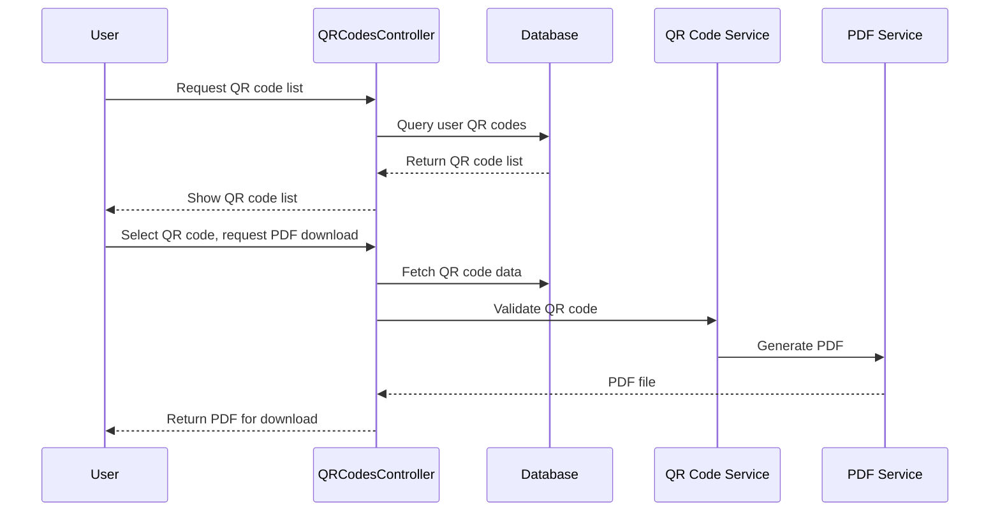
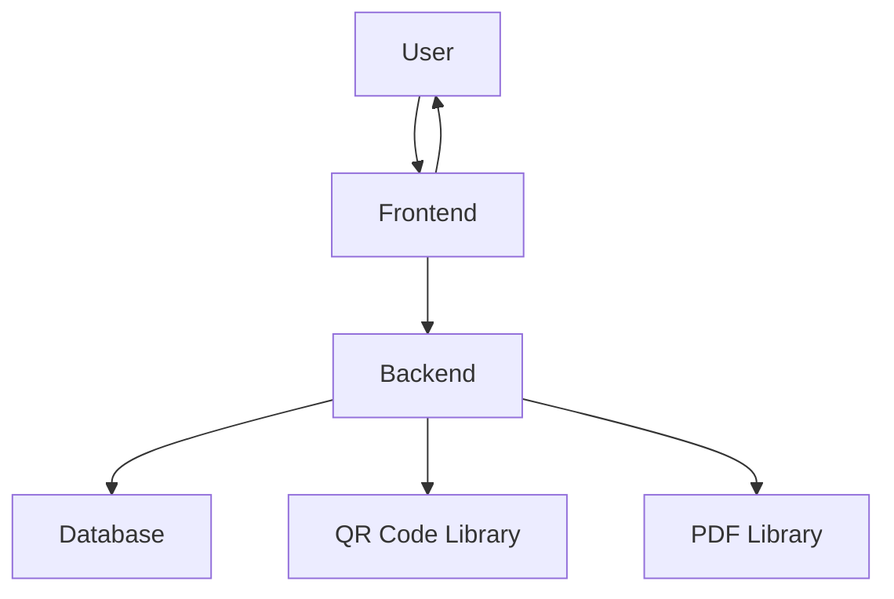
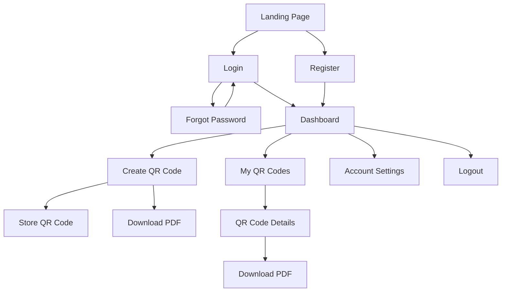
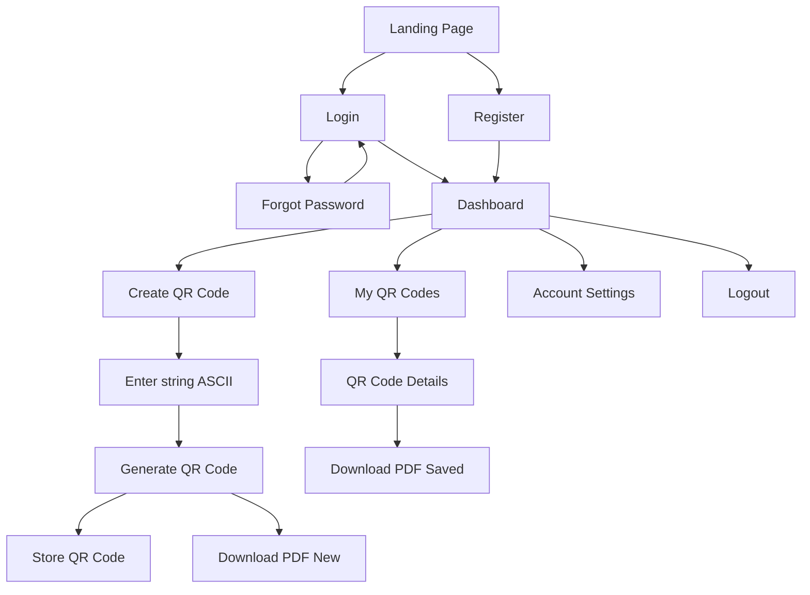

# System Architecture Specification: QR Code Web App

## 1. Overview
A secure, user-authenticated web application for generating, storing, and managing QR codes, built with ASP.NET Core 10 MVC. Users can create QR codes, store them in a personal database, and export them as PDF/SVG for AR/VR workflows (e.g., HoloLens 2).

## 2. Technology Stack Recommendations
- **Frontend:** Razor views (ASP.NET Core MVC)
- **Backend:** ASP.NET Core 10
- **Database:** SQL Server
- **Authentication:** ASP.NET Core Identity
- **ORM:** Entity Framework Core
- **QR Code Generation:** Net.Codecrete.QrCodeGenerator
- **PDF Export:** QuestPDF
- **Hosting:** On-premises (Windows OS)

## 3. Major Components & Responsibilities

### 3.1. Frontend (Razor Views)
- User registration, login, password reset
- Dashboard: create, browse, filter QR codes
- QR code creation page: form for inputting up to 100 ASCII alphanumeric symbols, selecting ECC (L, M, Q, H; default: M), and QR version (1–10; default: 5); provides feedback if input cannot be encoded
- My QR Codes: list, details, download
- Account settings
- Intuitive navigation, clear UI feedback

### 3.2. Backend (ASP.NET Core 10 MVC)
- User authentication/authorization (ASP.NET Core Identity)
- QR code generation (Net.Codecrete.QrCodeGenerator or similar), validates input string against selected ECC/version and returns feedback if encoding is not possible
- PDF export (QuestPDF or similar)
- Business logic for QR code management
- Data isolation per user

### 3.3. Database (SQL Server)
- Store user accounts and QR code parameters
- Associate QR codes with users (many-to-one)
- Support reproducibility of QR codes and secure access
- **Auto-Migration**: Database migrations are automatically applied on application startup (implemented 2026-02-16)

### 3.4. Infrastructure
- On-premises hosting (Windows OS preferred)
- Manual backup/DR (periodic SQL jobs)

### 3.5 Database Schema (ERD)

The application uses ASP.NET Core Identity for user management, which generates standard tables (e.g., AspNetUsers). Each QR code is associated with a user. QR codes are immutable (can only be created, read, or deleted).

**QR Code Table:**
 - Id (primary key, NOT NULL)
 - UserId (foreign key to AspNetUsers.Id, NOT NULL)
 - DecodedText (the string to encode, NOT NULL)
 - ErrorCorrectionLevel (L, M, Q, H; NOT NULL)
 - QRVersion (1–10, NOT NULL)
 - CreatedAt (timestamp, NOT NULL)
 - Notes (optional, nullable, for user annotation, max 300 characters)

**Entity Relationship Diagram:**

### 3.6 Controller Actions and Routes
All user interactions are handled via classical **ASP.NET Core MVC controllers** and **Razor views**. No public REST API is exposed.

### QR Code Operations (`QRCodesController`)

- **Create QR Code**
	- `GET /QRCodes/Create` — Show form
	- `POST /QRCodes/Create` — Submit new QR code (validates input, saves to DB)
- **List QR Codes**
	- `GET /QRCodes` — List all QR codes for current user
- **View QR Code Details**
	- `GET /QRCodes/Details/{id}` — Show details for a single QR code (only if owned by user)
- **Delete QR Code**
	- `POST /QRCodes/Delete/{id}` — Delete a QR code (confirmation required)
- **Download QR Code as PDF**
	- `GET /QRCodes/DownloadPdf/{id}` — Generate and download PDF (on demand, not stored)
- **Download QR Code as Image**
	- `GET /QRCodes/DownloadImage/{id}?format=svg|png` — Generate and download QR code image (on demand)

### User Operations (`AccountController` / Identity)

### User Operations (ASP.NET Core Identity Razor Pages)

- **Register**
	- `GET /Identity/Account/Register` — Show registration form
	- `POST /Identity/Account/Register` — Submit registration
- **Login**
	- `GET /Identity/Account/Login` — Show login form
	- `POST /Identity/Account/Login` — Submit login
- **Logout**
	- `POST /Identity/Account/Logout` — Log out user
- **Forgot Password**
	- `GET /Identity/Account/ForgotPassword` — Show form
	- `POST /Identity/Account/ForgotPassword` — Submit request

> Note: There is no AccountController. All authentication and registration logic is handled by ASP.NET Core Identity Razor Pages under /Identity/Account/.

### Security Considerations
* All QR code operations require authentication; users can only access their own QR codes.
* Anti-forgery tokens are used for POST actions.
* No edit or bulk operations are supported.
* Download endpoints validate ownership before serving files.

### 3.7 Component and Sequence Diagrams

### Component Diagram

### Sequence Diagram 1: Create and Download QR Code as PDF

### Sequence Diagram 2: Browse QR Codes and Download PDF

## 4. Integration Points & Data Flow

### 4.1. User Authentication
- ASP.NET Core Identity handles registration, login, password reset
- Data isolation: each user accesses only their own QR codes

### 4.2. QR Code Generation & Storage
- User inputs string (ASCII)
- Backend generates QR code (library)
- Parameters stored in SQL Server for reproducibility

### 4.3. PDF Export
- User can export QR code as PDF (SVG embedded)
- PDF generated server-side, downloaded by user

### 4.4. Data Flow Diagram

## 5. Key Diagrams

### 5.1. Information Architecture

### 5.2. User Flow

## 6. Security Model

### Authentication
- Use ASP.NET Core Identity for user registration, login, password reset, and logout.
- Enforce HTTPS for all authentication endpoints.
- Use secure cookies (HttpOnly, Secure, SameSite).

### Authorization
- Require authentication for all QR code operations.
- Ensure users can only access their own QR codes (check user ID on every data access).
- Use role-based or policy-based authorization if admin or special roles are added in the future.

### Data Isolation
- Always filter database queries by the current user’s ID.
- Never expose other users’ data in any controller/view.

### Anti-forgery
- Use ASP.NET Core’s built-in anti-forgery tokens for all POST actions (enabled by default in MVC forms).
- Validate anti-forgery tokens on all state-changing endpoints.

### Password Policies
- Enforce strong password requirements (min length, complexity, no common passwords).
- Use ASP.NET Core Identity’s password policy settings.
- Store passwords as salted, hashed values (handled by Identity).

### Audit/Logging
- Log authentication events (login, logout, failed login attempts).
- Log critical actions (QR code creation, deletion, download).
- Do not log sensitive data (passwords, full QR code content).
- Use structured logging (e.g., Serilog, built-in logging) and secure log storage.

### Session Management
- Set reasonable session timeouts.
- Invalidate sessions on logout or password change.

### Other
- Protect against XSS/CSRF/Clickjacking (use built-in MVC protections, set proper headers).
- Regularly update dependencies for security patches.

## 7. Validation & Error Handling

### Input Validation
- All user input is validated both client-side (using HTML5 validation and unobtrusive JavaScript) and server-side (using ASP.NET Core model validation attributes).
- Server-side validation is always enforced, regardless of client-side checks.
- Validation includes required fields, string length, allowed characters (ASCII alphanumeric for QR codes), and valid ranges for ECC and QR version.

### Error Feedback to Users
- Validation errors are displayed inline on forms with clear, user-friendly messages.
- For non-validation errors (e.g., failed operations), display a generic error message and log the technical details.
- Avoid exposing sensitive or technical error details to end users.

### Error Logging & Global Error Handling
- All unhandled exceptions are caught by a global error handler (ASP.NET Core middleware or custom error handling filter).
- Errors are logged using structured logging (e.g., Serilog or built-in logging).
- Logs include timestamp, user ID (if authenticated), action, and error details (but never sensitive data).
- Critical errors may trigger alerts for administrators (optional, for future enhancement).
- Users are shown a friendly error page for unhandled exceptions.

## 8. Deployment & Infrastructure

### Hosting Environment
- The application is hosted on-premises, intended for internal/in-house use only.
- Not exposed to the general public or internet.

### Deployment Process
- Initial deployment is performed manually (no CI/CD pipeline at MVP stage).
- Application and configuration files are copied to the target Windows server.
- IIS or Kestrel can be used as the web server.

### Backup & Restore
- No automated backup solution is planned for MVP.
- A scheduled job on SQL Server will periodically back up the database.
- Manual restore procedures will be documented as needed.

### Monitoring & Logging
- Error and event logging is handled as described in the Validation & Error Handling section.
- No external monitoring or alerting system is planned for MVP.

### Configuration
- All required configuration (e.g., connection strings, app settings) is stored in configuration files (appsettings.json, etc.).
- No use of environment variables is planned for MVP.

## 9. Non-Functional Requirements

### Performance
- The application must generate QR codes and export PDFs quickly for single operations (target: under 1 second per operation for typical use).
- The UI should respond to user actions with minimal delay.

### Scalability
- The system is designed for a small internal user base (single team or department).
- No horizontal scaling or load balancing is planned for MVP; vertical scaling (adding resources to the server) is possible if needed.

### Availability
- The application is expected to be available during business hours; 24/7 uptime is not required.
- Occasional downtime for maintenance or updates is acceptable.

### Maintainability
- The codebase follows standard ASP.NET Core MVC patterns for ease of maintenance.
- Clear separation of concerns (controllers, services, data access) is enforced.
- Configuration is centralized in config files.
- Automated tests and code reviews are recommended for future development.

### Support
- Minimal user support is expected; the app is for internal use by technical staff.
- Support will be provided by the development team as needed.

### Documentation
- Basic user and admin documentation will be provided (e.g., README, setup guide, usage instructions).
- Inline code comments and architectural documentation (this file) support future maintenance and onboarding.

## 10. Constraints & Assumptions

- Minimal budget, internal project
- Tight timeline: MVP as soon as possible
- Small team or single developer
- Only core features, no post-MVP development
- Security: user authentication, data isolation
- Performance: fast QR code generation and PDF export
- Browser/OS: Modern browsers (Edge, Chrome, Firefox), Windows OS
- Hosting: On-premises
- No external integrations
- Minimal support/documentation

## 11. Risks & Open Questions

- Security risks if authentication is not properly configured
- Dependency on QR code and PDF libraries for compatibility
- No automated backup/DR; manual SQL jobs
- Regulatory/compliance: only email/password stored

This architecture is designed for simplicity, reliability, and user-centric workflows, supporting AR/VR teams with secure, reproducible QR code management and PDF export.

## 12. Glossary

ASP.NET Core Identity
: Microsoft’s authentication and user management framework for ASP.NET Core applications.

AR/VR
: Augmented Reality / Virtual Reality.

ECC
: Error Correction Code (L, M, Q, H: levels of QR code error correction).

Entity Framework Core (EF Core)
: Microsoft’s ORM for .NET.

MVP
: Minimum Viable Product.

PDF
: Portable Document Format.

QR Code
: Quick Response Code, a type of 2D barcode.

QuestPDF
: .NET library for generating PDF documents.

Razor Views
: ASP.NET Core’s server-side HTML templating engine.

SQL Server
: Microsoft’s relational database management system.

SVG
: Scalable Vector Graphics, an XML-based image format.
