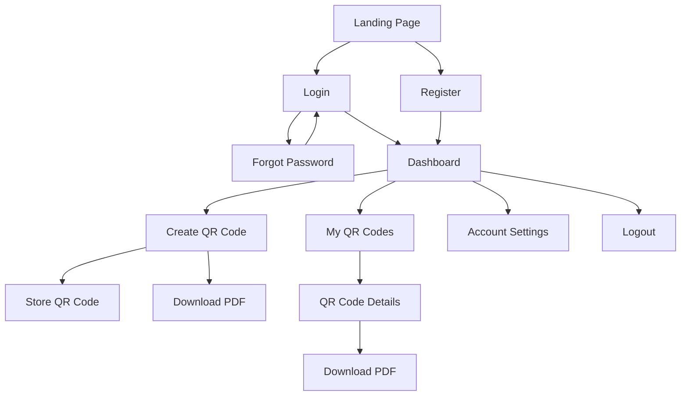
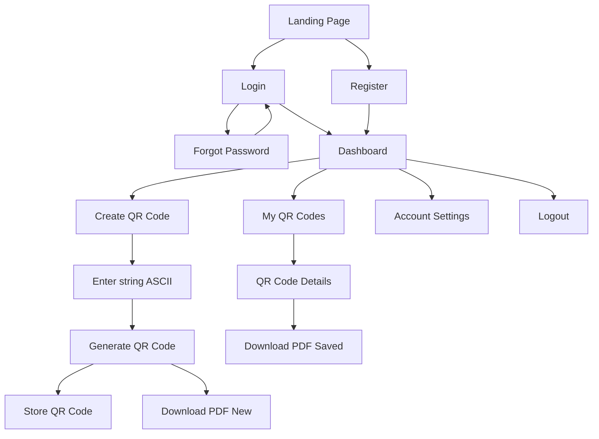
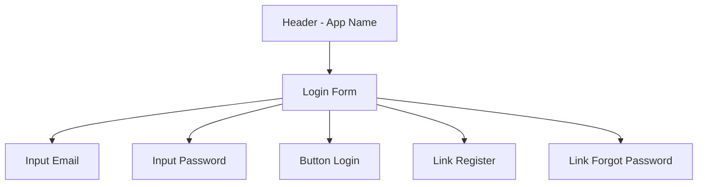
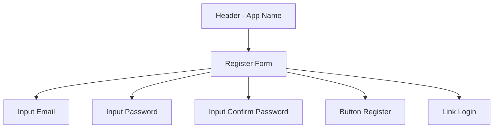
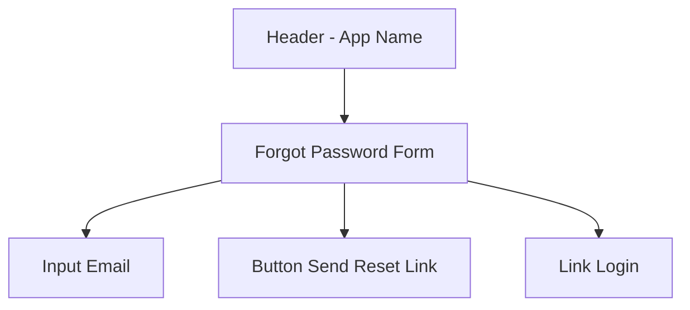
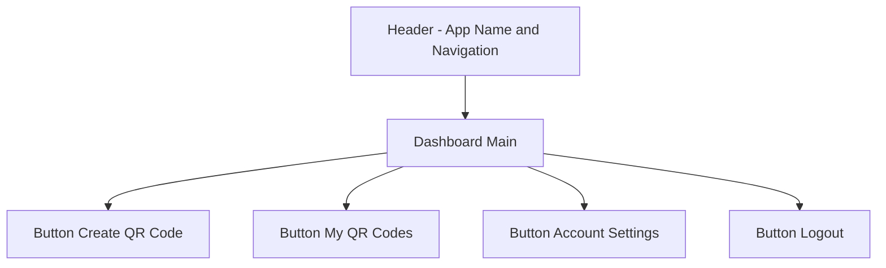
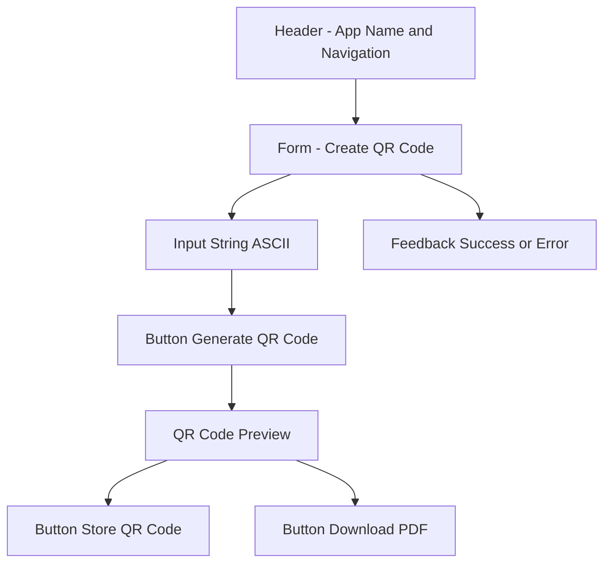
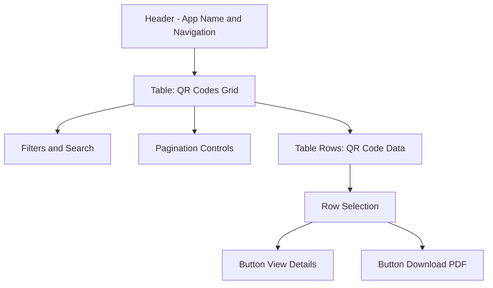
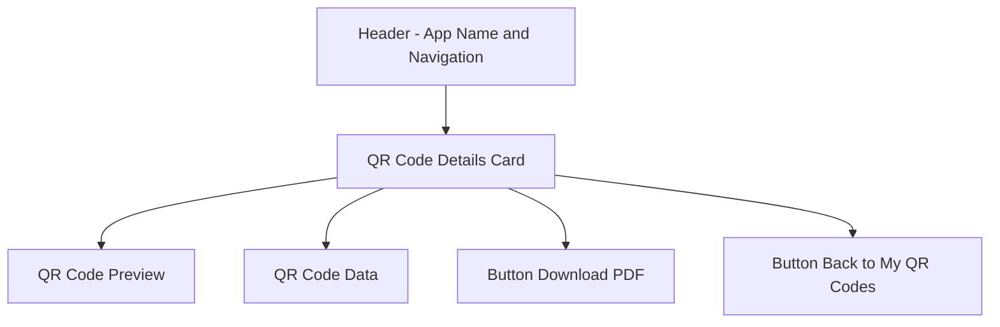
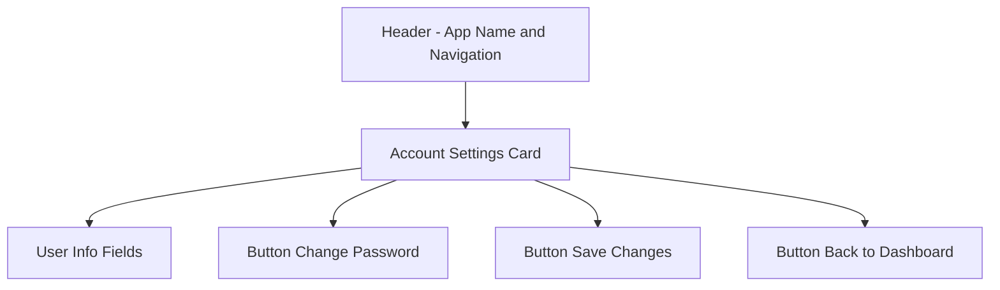

# UI/UX Specification: QR Code Web App
#
# Technical Stack Note: QuestPDF will be used for PDF export.

## Introduction
This document defines the user experience goals, information architecture, user flows, and visual design specifications for the QR Code Web App’s user interface. It serves as the foundation for visual design and frontend development, ensuring a cohesive and user-centered experience.

### Overall UX Goals & Principles

#### Target User Personas
- Developer/Engineer/Team Member: Registers independently, generates and manages their own QR codes for AR/VR workflows. Responsible for their own data—no admin oversight.

#### Usability Goals
- Users can generate and store a QR code in under 1 minute.
- 95%+ successful PDF exports without errors.
- Intuitive navigation and minimal learning curve.
- QR codes are reliably readable by AR/VR devices (e.g., HoloLens 2) using ASCII encoding.

#### Core Design Principles
1. User Ownership: Each user manages only their own QR codes—no admin role required.
2. Simplicity: Streamlined flows for quick QR code creation and export.
3. Clarity: Use clear, consistent UI patterns and feedback.
4. Reliability: Ensure QR codes are always generated in ASCII for AR/VR compatibility.

---

## Information Architecture (IA)

- Users start at Login/Register
- After authentication, they land on the Dashboard
- From the Dashboard, users can:
  - Create QR Code → Store QR Code or Download PDF
  - View “My QR Codes” (list of their own codes) → QR Code Details → Download PDF
  - Access Account Settings
  - Logout

---

## Navigation Structure

**Primary Navigation:**
- Dashboard
- Create QR Code
- My QR Codes
- Account Settings
- Logout

**Secondary Navigation:**
- Within “My QR Codes”: QR Code Details, Download PDF
- Within “Create QR Code”: Store QR Code, Download PDF

**Breadcrumb Strategy:**
- Simple breadcrumbs for “My QR Codes > QR Code Details”
- No breadcrumbs needed for top-level pages (Dashboard, Create QR Code)

---

## User Flows

### QR Code Creation Form Requirements
- User can enter a string of up to 100 ASCII alphanumeric symbols
- User selects Error Correction Code (ECC) level (L, M, Q, H; default: M)
- User selects QR version (1–10; default: 5)
- User can enter an optional Notes field (textarea) limited to 300 characters
- The app validates input and provides immediate feedback if the string cannot be encoded with the selected ECC/version

- User logs in/registers → Dashboard
- Create QR Code → Enter string (ASCII) → Generate QR Code → Store QR Code and/or Download PDF
- My QR Codes → QR Code Details → Download PDF
- Account Settings / Logout

---

## Visual Design Specifications

### Framework
This project will use **Bootstrap 5** as the CSS framework for styling and UI components. Bootstrap provides a robust set of pre-built styles and components, ensuring consistency, responsiveness, and rapid development. Custom styles and variables will be applied as needed to match the color palette and design principles outlined below.

### Color Palette
- **Primary color:** #2563eb (blue, for actions and highlights)
- **Secondary color:** #f3f4f6 (light gray, for backgrounds)
- **Accent color:** #10b981 (green, for success states)
- **Error color:** #ef4444 (red, for errors/validation)
- **Text color:** #111827 (dark gray/black)

### Typography
- **Font family:** 'Segoe UI', 'Roboto', Arial, sans-serif
- **Headings:** Bold, clear, 1.5x line height
- **Body:** Regular, 1.5x line height, 16px base size

### Spacing & Layout
- **Spacing:** 16px base grid, with multiples for padding/margins
- **Container width:** Max 600px for forms, centered on page
- **Buttons:** Prominent, with clear labels and sufficient padding

### UI Components
- **Input fields:** Large, clear, with placeholder text and validation feedback
- **Primary button:** Blue, full-width for main actions (e.g., Generate QR Code)
- **Secondary button:** Gray or outlined, for less critical actions
- **Alerts:** Use green for success, red for errors, with clear icons
- **Card/list:** For displaying stored QR codes, with action buttons (view, download)

---

### Authentication Pages
The application includes dedicated pages for Login, Register, and Forgot Password. Each page uses a simple, centered form with clear labels, Bootstrap validation, and navigation links to switch between authentication actions. Success and error feedback is shown inline.

## Wireframe: Login Page

---

## Wireframe: Register Page

---

## Wireframe: Forgot Password Page

---

## Wireframe: Dashboard

---

## Wireframe: Create QR Code Page

> **Note:** All actions (input, generate, store, download) are on one page. Feedback is shown inline after actions.

---

## Wireframe: My QR Codes Page

> **Note:** The QR codes are displayed in a table/grid with filters, search, and pagination. The user selects a row, then can use View Details or Download PDF buttons above or below the table.

---

## Wireframe: QR Code Details Page

---

## Wireframe: Account Settings Page

